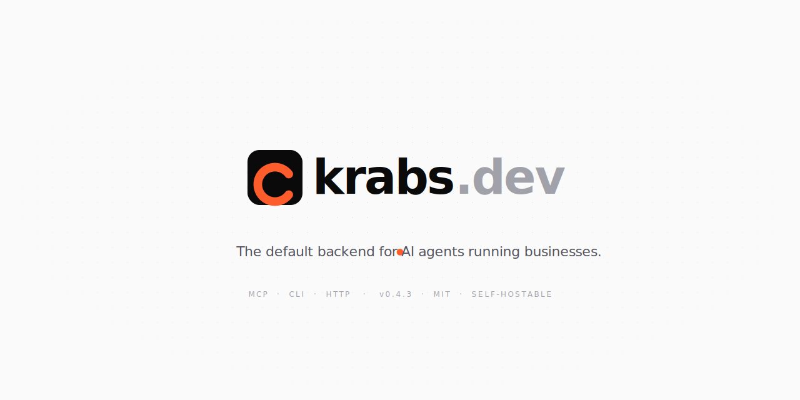
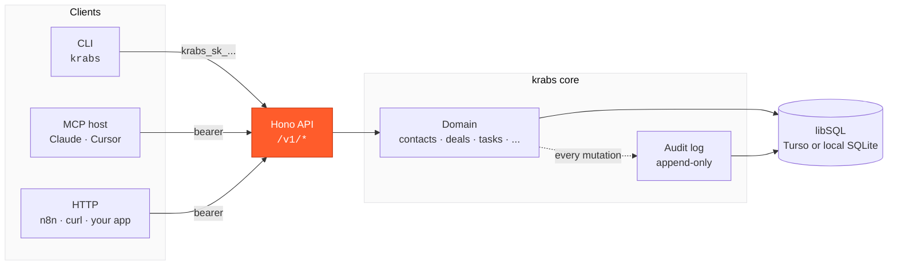
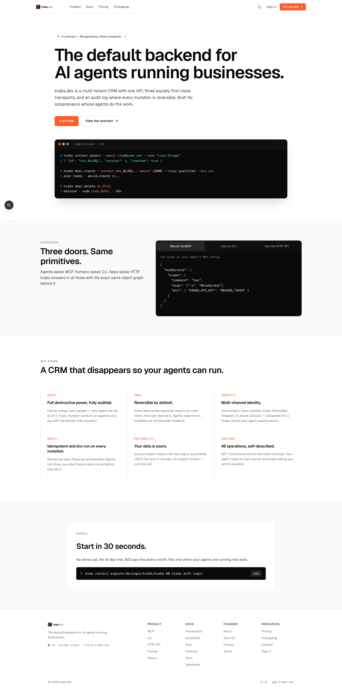
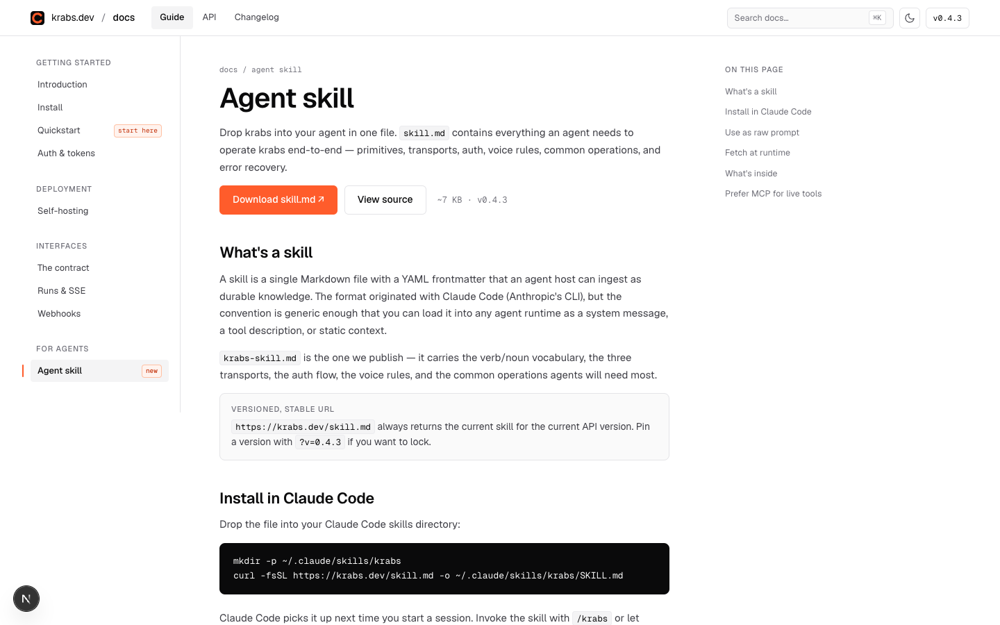
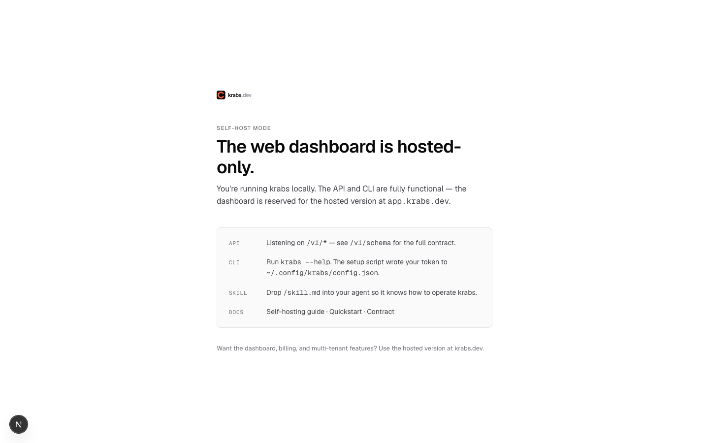

<p align="center">
  <picture>
    <source media="(prefers-color-scheme: dark)" srcset="public/brand/repo-banner-dark.svg">
    
  </picture>
</p>

<p align="center">
  <a href="https://krabs.dev">krabs.dev</a> ·
  <a href="https://krabs.dev/docs">docs</a> ·
  <a href="https://krabs.dev/changelog">changelog</a> ·
  <a href="https://krabs.dev/status">status</a>
</p>

<p align="center">
  
  
  
  <a href="https://github.com/augusto-devingcc/krabs/stargazers"></a>
</p>

---

## What is krabs

krabs is a multi-tenant CRM designed to be operated by AI agents, not humans clicking through pages. The same primitives Salesforce and HubSpot have spent 25 years getting right — contacts, identities, deals, interactions, tasks, notes, tags — are reachable over three equally first-class transports: MCP (`mcp.krabs.dev`), CLI (`krabs`), and HTTP (`api.krabs.dev`). Every mutation is idempotent, dry-runnable, and reversible via a 24-hour undo token. Every call lands in an append-only audit log alongside the prompt that caused it.

## Why

Existing CRMs assume the operator is a human reading forms. They expose CRUD verbs, modal dialogs, and 14-step wizards. Drop a model into one of them and it spends most of its context window navigating UI it cannot see.

krabs assumes the operator is a model. Endpoints are verb-noun (`contact.upsert`, `deal.create`, `account.export`). The full contract is machine-readable at `/v1/schema`. Destructive operations return undo tokens. Mutations accept `Idempotency-Key`. The model reads its own manual, retries safely, and previews before writing — the same primitives the old CRMs got right, reachable as tools instead of pages.

## Three doors. Same primitives.

| transport | endpoint | for |
|---|---|---|
| `MCP` | `mcp.krabs.dev` | agentic hosts — Claude Desktop, Cursor, Claude Code |
| `CLI` | `krabs` | shell-driven agents, humans, scripts |
| `HTTP` | `api.krabs.dev` | everything else — n8n, cron, your own UI |

The same operation. The same response shape. The same object graph behind it.



## Install in one line (self-host, open source)

```bash
curl -fsSL https://krabs.dev/install.sh | sh
```

That's the whole install. The script checks for Node.js 22+, enables `pnpm` via corepack if needed, clones the repo into `~/krabs`, runs `pnpm install`, runs `pnpm kickoff`, and symlinks the `krabs` binary onto your PATH. When it finishes you'll have:

- A local SQLite database with all 11 migrations applied
- An API key minted and saved to `~/.config/krabs/config.json`
- A printed MCP config snippet ready to paste into Claude Desktop / Cursor
- The `krabs` CLI on your PATH

Then in another terminal:

```bash
cd ~/krabs && pnpm dev:api
```

And tell your agent (Claude Desktop, Cursor, Claude Code) literally this one sentence:

> Read https://krabs.dev/skill.md and run the kickoff.

The agent fetches the skill, sees `business_profile` is null, runs the kickoff conversation (revenue model · cadence · ad channels · contract size), and persists your answers via `businessProfile.set`. No training docs to copy-paste.

> No npm publish required. No Homebrew tap required. The CLI lives in the cloned repo at `dist/cli/main.mjs` and gets symlinked onto your PATH automatically. See [`docs/install`](https://krabs.dev/docs/install) for alternative install paths (git clone manual, `npx github:augusto-devingcc/krabs`, prebuilt binary from GitHub Releases).

## Quickstart (hosted SaaS)

```bash
curl -fsSL https://krabs.dev/install.sh | sh   # gives you the CLI
krabs auth login --api-url https://api.krabs.dev
```

The `auth login` command runs the OAuth 2.0 device flow: opens a browser at `krabs.dev/device`, you approve, the CLI receives its token. Get a free tier at [krabs.dev/sign-up](https://krabs.dev/sign-up) — 500 ops/month forever, no credit card.

## Self-host quickstart — manual (no installer script)

If you prefer to read every step yourself, the installer is doing this:

```bash
git clone https://github.com/augusto-devingcc/krabs.git
cd krabs
cp .env.example .env
pnpm install
pnpm kickoff          # builds CLI + MCP server, mints a local key, prints MCP config
pnpm dev:api          # starts the Hono API on :3000 (in another terminal)
```

In another terminal:
```bash
krabs schema describe
krabs contact list
```

The web dashboard at `/dashboard/*` is hosted-only. In self-host mode you'll see a [self-host info page](http://localhost:3000/self-host) instead. The full API + CLI are functional. Docker setup: see [`docs/self-hosting`](https://krabs.dev/docs/self-hosting).

## The contract

krabs makes five guarantees on every operation:

1. **Intent.** Every endpoint is a verb-noun (`contact.upsert`, `deal.create`). No CRUD verbs leaking into the model.
2. **Idempotency.** Every mutation accepts an `Idempotency-Key`. Retries are safe.
3. **Dry-run.** Every mutation accepts `--dry-run`. Returns a plan, writes nothing.
4. **Schema introspection.** `GET /v1/schema` returns the full contract. Your agent reads its own manual.
5. **Reversible audit.** Every write lands in an append-only log. Destructive writes return an `undo_token` valid for 24 hours.

Full machine-readable schema: [api.krabs.dev/v1/schema](https://api.krabs.dev/v1/schema).

## What it looks like

<p align="center">
  
</p>

<p align="center">
  <em>The landing at <a href="https://krabs.dev">krabs.dev</a> — terminal-style hero, three doors / same primitives, feature grid, install CTA.</em>
</p>

<table>
  <tr>
    <td></td>
    <td></td>
  </tr>
  <tr>
    <td><em>Docs: <a href="https://krabs.dev/docs/skill">/docs/skill</a></em></td>
    <td><em>Self-host info page (no Clerk required)</em></td>
  </tr>
</table>

## Tech stack

- **Runtime:** Node 22+, Next.js 16 (App Router), Hono (the API)
- **DB:** libSQL via Drizzle ORM. Hosted = Turso. Self-host = SQLite file.
- **Auth (hosted):** Clerk. Device flow (RFC 8628) for agents.
- **Frontend:** React 19, Tailwind 4, shadcn/ui (radix-nova style), Geist font
- **CLI:** Node, commander, bundled with tsdown into a single-file binary
- **Deploy:** Vercel + Turso Cloud for hosted. Docker for self-host (shipping v0.5).

## Repository layout

```
.
├── app/                   ← Next.js routes
│   ├── (marketing)/       ← landing, /about, /pricing, /changelog, /status, …
│   ├── (dashboard)/       ← authenticated web UI (Clerk-gated)
│   ├── docs/              ← public docs
│   ├── device/            ← OAuth 2.0 device approval page
│   └── api/v1/[...path]/  ← Hono entry point
├── src/
│   ├── api/               ← Hono routes + middleware
│   ├── domain/            ← business logic (no I/O, no auth)
│   ├── db/                ← Drizzle schema + migrations
│   ├── cli/               ← CLI command implementations (source)
│   ├── contract/          ← Zod schemas, id prefixes, error types
│   └── lib/               ← shared utilities (hash, brand, …)
├── cli/                   ← publishable npm package (wraps src/cli)
├── components/            ← React components
├── public/                ← static assets + skill.md
└── Formula/krabs.rb       ← Homebrew formula (copy to a tap repo to publish)
```

## Agents

krabs is designed for agents first. Drop the skill into any agent host:

```bash
mkdir -p ~/.claude/skills/krabs
curl -fsSL https://krabs.dev/skill.md -o ~/.claude/skills/krabs/SKILL.md
```

Or fetch at runtime. The skill teaches your agent the verb/noun vocabulary, the three transports, the auth flow, the voice rules, and the common operations. See [docs/skill](https://krabs.dev/docs/skill).

For live tool execution, prefer the MCP server at `mcp.krabs.dev`.

## Contributing

PRs welcome. Read [CONTRIBUTING.md](./CONTRIBUTING.md) before opening one.

For bug reports and feature requests, [open an issue](https://github.com/augusto-devingcc/krabs/issues/new/choose).

For security disclosures, see [SECURITY.md](./SECURITY.md) — do **not** open a public issue.

## License

[MIT](./LICENSE). © 2026 Augusto García.

---

<p align="center">Built in Panama · One operator at a time.</p>
