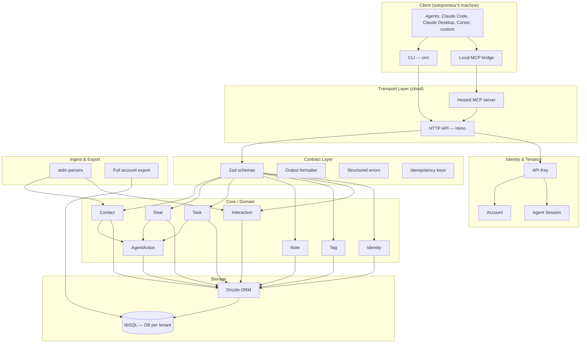
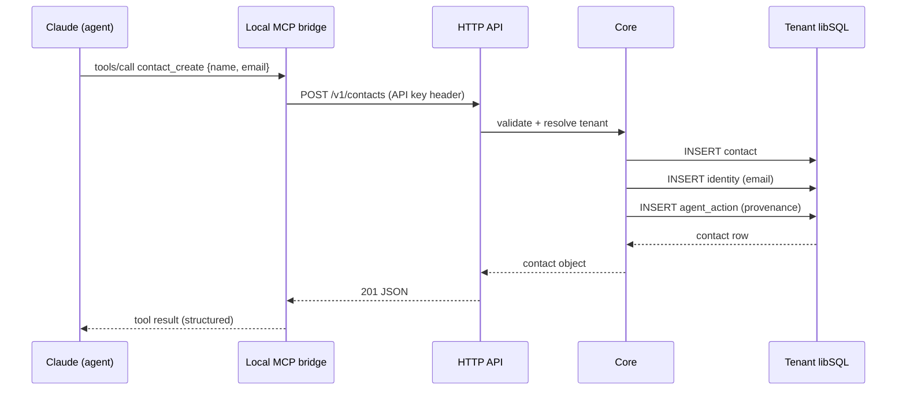
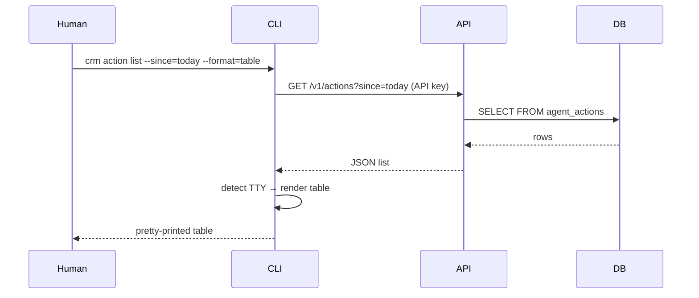

# Solo Agentic CRM — System Architecture

## Overview

Solo Agentic CRM is a multi-tenant SaaS built for **solopreneurs in the AI era** — people who run a one-person business amplified by a fleet of agents (Claude Code, Claude Desktop, Cursor, custom agents, automations). The product is designed from the ground up so that the human owner *and* their agents are equally first-class users.

There are no workspaces, no teams, no seats. **One account = one human + N of their agents.** Multi-tenancy exists at the account level because many solopreneurs will use the product, each in full isolation.

The product has three equal-weight surfaces:

1. **CLI** — for the solopreneur and for any agent with shell access
2. **MCP server** — for any MCP-capable client (Claude Desktop, Claude Code, Cursor, etc.) to plug in natively
3. **HTTP API** — for everything else (webhooks, custom scripts, future web dashboard)

All three are thin transports over the same core. There is no "primary" interface — the contract is the product.

## Design Principles

1. **Agent-first, human-comfortable** — every command is designed for an agent to invoke; humans get good ergonomics on top (colors, tables, prompts) when the output is a TTY.
2. **One contract, three transports** — CLI, MCP, and HTTP expose identical operations with identical semantics. A capability added to one is added to all three.
3. **Self-describing** — agents discover the system by asking it, not by reading docs. `crm schema` returns the full operation graph as JSON.
4. **Deterministic and auditable** — every mutation records *which agent* did it, *when*, with *what intent*. The solopreneur can audit their agent fleet.
5. **Data portability is sacred** — a solopreneur will outgrow or distrust any tool eventually. Full, lossless export is a first-class feature, not a migration utility.
6. **Boring tech, narrow surface** — single language (TypeScript), single DB engine, minimal moving parts. The complexity goes into the contract, not the stack.

## Deployment Model

Solo Agentic CRM is a **cloud-hosted SaaS** with a CLI/MCP client that solopreneurs install locally.

```
┌─────────────────────────────────────────────────────────┐
│  Solopreneur's machine                                  │
│                                                         │
│   ┌─────────┐    ┌──────────────┐   ┌─────────────┐    │
│   │   CLI   │    │ Local MCP    │   │  Their      │    │
│   │ (crm)   │    │ stdio bridge │◄──┤  agents     │    │
│   └────┬────┘    └──────┬───────┘   └─────────────┘    │
│        │                │                               │
└────────┼────────────────┼───────────────────────────────┘
         │                │
         │   HTTPS + API key
         │                │
┌────────▼────────────────▼───────────────────────────────┐
│  Solo Agentic CRM Cloud                                 │
│                                                         │
│   ┌──────────────────────────────────────────────┐     │
│   │  HTTP API (Hono) — single source of truth    │     │
│   └──────────────────────────────────────────────┘     │
│                       │                                 │
│   ┌───────────────────┴──────────────────────────┐     │
│   │  Core (domain, contract, provenance)         │     │
│   └───────────────────┬──────────────────────────┘     │
│                       │                                 │
│   ┌───────────────────┴──────────────────────────┐     │
│   │  Storage — DB-per-tenant (libSQL/Turso)      │     │
│   └──────────────────────────────────────────────┘     │
│                                                         │
└─────────────────────────────────────────────────────────┘
```

The solopreneur signs up at the website, gets an API key, and runs `crm auth login` once. From that moment, both they and their agents can call the CRM from anywhere.

A web dashboard exists only for signup, billing, API key management, and account settings. It is **not** where work gets done — work happens in the agent.

## System Architecture



## The Agent Contract

This is the part that makes the CRM "agentic" rather than "a CRM with an API." Every operation — whether invoked via CLI, MCP, or HTTP — obeys these rules:

### Self-description
- `crm schema` returns the full operation graph (commands, entities, fields, validation rules) as JSON. An agent can bootstrap itself with zero prior knowledge.
- The MCP `list_tools` endpoint is generated from the same schema.
- The HTTP API serves an OpenAPI spec at `/openapi.json`.
- All three are generated from a single Zod-based source of truth.

### Output
- Output is JSON by default when stdout is not a TTY, and pretty-printed (table/colors) when it is.
- `--json` and `--format=<json|table|yaml|csv>` force the format.
- JSON output is stable and versioned. Schema version is returned in every response (`"_schema_version": "1"`).

### Errors
- Errors are structured objects: `{ "error": { "code": "...", "message": "...", "hint": "...", "field": "..." } }`.
- Error codes are stable identifiers (`CONTACT_NOT_FOUND`, `IDEMPOTENCY_CONFLICT`, etc.), not free-form strings.
- CLI exit codes follow a documented map (0 success, 2 validation error, 3 not found, 4 conflict, 5 auth, etc.).

### Mutations
- Every mutation accepts an optional `--idempotency-key` (CLI) / `Idempotency-Key` header (HTTP) / `idempotencyKey` argument (MCP). Replays with the same key return the original result without re-executing.
- Destructive operations require `--confirm` or accept `--dry-run`. Dry-run returns the change set the operation would produce.

### Reads
- Lists are paginated by cursor. `nextCursor` is returned when more results exist.
- Filters are explicit and composable (`--status=lead --tag=warm --updated-since=2026-01-01`).
- A `--fields` selector controls which fields are returned, for token-efficient agent reads.

### Discoverability
- Every command supports `--help` (human) and `--explain` (returns the JSON schema for that command's arguments and output).

## Component Details

### Transport Layer

#### HTTP API
- **Framework**: Hono — small, fast, runs on Node and edge runtimes if needed.
- **Responsibilities**: authentication (API key), request validation, routing to core, response formatting.
- It is the single source of truth. CLI and MCP both call it.

#### CLI (`crm`)
- **Framework**: Commander.js (mature, predictable, good Node ecosystem fit).
- **Responsibilities**: parse args, call HTTP API with API key from local config, format output for TTY vs. pipe, manage local config (`~/.config/solo-crm/config.json`).
- **Distribution**: published to npm; installable via `npm i -g @solo-crm/cli` or `pnpm dlx`. Single-binary builds (Node SEA) considered for v2.

#### MCP Server
- **SDK**: `@modelcontextprotocol/sdk` (official).
- **Two modes**:
  - **Hosted**: a remote MCP endpoint clients can connect to directly (when MCP transport over HTTP is widely supported).
  - **Local bridge**: a stdio MCP server bundled with the CLI, started via `crm mcp serve`. The bridge translates MCP tool calls into HTTP API calls. This is the path that works *today* with Claude Desktop, Claude Code, Cursor.
- Tool definitions are generated from the same Zod schemas as CLI commands.

### Contract Layer

#### Schema (Zod)
- A single set of Zod schemas defines every command's inputs and outputs.
- Used at runtime (request validation), at build time (OpenAPI generation, MCP tool generation), and exposed via `crm schema`.

#### Output Formatter
- JSON (default for non-TTY) — stable, versioned.
- Table, YAML, CSV for humans or specific agent needs.
- Streaming output for long lists (`crm contact list --stream`).

#### Structured Errors
- One error class hierarchy mapped to error codes and HTTP statuses.
- Errors are never strings. Always an object with `code`, `message`, optional `hint`, optional `field`.

#### Idempotency
- Idempotency keys stored per-account with a 24h TTL. Replays return the cached result.

### Identity & Tenancy

#### Account
- The unit of tenancy. One human owner. Created via signup.
- Has billing status, plan, created/updated timestamps.

#### API Keys
- Authentication mechanism for CLI, MCP, and HTTP. Multiple keys per account (so the solopreneur can revoke a single agent without disrupting others).
- Each key has a label (e.g., "Claude Code on MacBook", "Zapier webhook").
- Keys are hashed at rest. Last-used timestamp tracked.

#### Agent Session (optional, recommended)
- An optional session ID an agent can pass with each request to group operations.
- Used for AgentAction provenance (see below). Lets the owner see "what did my Claude Code session on 2026-05-15 do in the CRM?"

There is **no** user-vs-user permission model, no roles, no JWT, no OAuth in v1. API key auth is sufficient because there is only one user per account.

### Domain Layer

#### Contact
- The person. Names, primary email, primary phone, status (lead/customer/etc.), custom fields (JSONB), tags.
- A Contact has many `Identity` records (see below).

#### Identity (multi-channel)
- A first-class concept: the same Contact can be reached via multiple channels (email addresses, phone numbers, WhatsApp ID, Telegram handle, LinkedIn URL, Twitter handle, etc.).
- Each Identity has a kind, value, and confidence score.
- Identity merge is a primary operation: `crm contact merge <a> <b>` consolidates two Contacts that turned out to be the same person.

#### Deal
- A revenue opportunity tied to a Contact. Stage, value, currency, expected close date.
- Pipelines are configurable per account.

#### Task
- An action item, optionally tied to a Contact, Deal, or Note. Due date, priority, status.
- Created freely by both human and agents.

#### Note
- Free-form text content attached to a Contact, Deal, or standalone.
- Supports markdown. Full-text indexed (libSQL FTS5).

#### Tag
- Flat tagging. No hierarchies in v1 — simpler for agents to reason about.
- Tags are scoped to the account.

#### Interaction
- An immutable log entry: "email received from X on date Y," "call logged with X," "meeting at Z."
- Source-tagged (email, call, meeting, agent, manual).
- This is the timeline. Agents append to it; humans read it.

#### AgentAction (provenance)
- Every mutation produces an AgentAction record: `{ actor (api_key_id), session_id, operation, target_entity, target_id, intent (optional free text the agent provides), timestamp }`.
- This is the audit trail of the agent fleet. Queryable: `crm action list --since=yesterday --actor=<key>`.

### Storage Layer

#### Drizzle ORM
- Schema as TypeScript. No separate schema file, no codegen daemon, no Prisma binary.
- Plays cleanly with libSQL.

#### libSQL (Turso) — Database per tenant
- **Each account gets its own libSQL database.** This is the multi-tenancy strategy.
- Rationale:
  - **Isolation**: no `WHERE tenant_id = ?` filtering. A bug in a query cannot leak data across tenants.
  - **Portability**: a full account export is literally the SQLite file. The solopreneur owns their data, end of story.
  - **Per-tenant operations**: a single tenant can be migrated, restored from backup, or wiped without touching others.
  - **Scale**: Turso supports thousands of small databases on a single fleet. Solopreneurs have small data (10s of thousands of rows).
- Schema migrations are applied to every tenant DB on deploy via a migration runner.

Postgres + row-level security with a `tenant_id` column is the standard alternative. We choose libSQL-per-tenant because the portability and isolation properties fit the audience (solopreneurs care about data ownership more than enterprise teams care about it).

### Ingest & Export

#### Ingest
- `crm interaction ingest --type=email < message.eml` — parses an email, links it to the right Contact by sender, creates an Interaction.
- `crm contact import < contacts.csv` — bulk import with validation.
- Designed for agents to pipe data in.

#### Export
- `crm export --account` — returns a tarball with the libSQL file, every attachment, and a JSON dump.
- `crm export --entity=contact --format=csv` — partial exports.
- Export is a guaranteed, lossless operation. The solopreneur can leave at any time with everything.

## Multi-Tenancy Strategy

| Concern | Approach |
|--------|----------|
| Isolation | One libSQL database per account. No shared tables. |
| Routing | API gateway resolves API key → account ID → DB connection string. |
| Migrations | Migration runner enumerates all tenant DBs and applies in parallel. Versioned. |
| Backups | Turso point-in-time recovery per DB. |
| Tenant creation | On signup, provision a new libSQL DB and run initial schema. |
| Tenant deletion | On account close, schedule DB deletion after grace period. |

## Provenance & Agent Audit

Every mutation writes an AgentAction record. This is the agentic-native feature that no incumbent CRM has.

Example:

```
$ crm action list --since=yesterday
ID         WHEN              ACTOR                 OPERATION              TARGET
act_01HZ.. 2026-05-14 09:12  key:claude-code-mac   contact.update        cnt_01HY..
act_01HZ.. 2026-05-14 09:13  key:claude-code-mac   interaction.create    cnt_01HY..
act_01HZ.. 2026-05-14 11:40  key:zapier-webhook    contact.create        cnt_01HZ..
act_01HZ.. 2026-05-14 14:02  human                 deal.stage_change     dl_01HX..
```

The solopreneur can answer "what did my agents do today?" with one command. They can revoke an API key and see exactly which records that key touched.

## Technology Stack

### Core
- **Runtime**: Node.js 22 LTS
- **Language**: TypeScript 5+ (strict)
- **HTTP**: Hono
- **CLI**: Commander.js
- **MCP**: `@modelcontextprotocol/sdk`
- **ORM**: Drizzle
- **DB**: libSQL (Turso) — DB per tenant
- **Validation**: Zod
- **Testing**: Vitest

### Auxiliary
- **Build**: tsdown (or tsup)
- **Package manager**: pnpm
- **Logging**: pino (structured JSON)
- **CLI UX**: yoctocolors, cli-table3
- **Billing**: Polar (subscription, MoR)
- **Email (signup, magic link)**: Resend or Postmark — TBD

### Hosting (initial)
- API: Fly.io or Railway (stateful-friendly, fits libSQL well). Vercel is fine if we keep the API stateless.
- DB: Turso (managed libSQL).
- Marketing site + dashboard: Vercel (Next.js).

### Explicitly NOT in the stack
- Redis (no caching layer needed at solopreneur scale)
- Prisma (Drizzle wins for this stack)
- Postgres (libSQL-per-tenant wins for portability)
- JWT / OAuth providers / RBAC (API keys are enough)
- Inquirer REPL (the agent is the REPL)
- Plugin system (premature — revisit when users ask)
- Webhook framework (revisit in v2)

## Data Flow Example — Agent creating a contact via MCP



## Data Flow Example — Solopreneur reviewing what their agents did



## Security

### Authentication
- API keys, hashed at rest with Argon2id.
- Key prefix (e.g., `crm_live_`) for easy identification in logs and code reviews.
- Last-used timestamp tracked per key.
- Owner can revoke any key from the dashboard.

### Transport
- TLS everywhere. HSTS on the dashboard.
- Rate limiting per API key (token bucket, configurable per plan).

### Data
- libSQL DBs encrypted at rest (Turso default).
- Backups encrypted.
- A signed full-account export can be downloaded by the owner at any time.

### Input
- All inputs validated by Zod at the API boundary.
- No raw SQL accepted from clients.

### Secrets
- Server-side secrets in environment variables (Fly secrets / Vercel env).
- API keys for third parties (Polar, Resend) per environment.

## Observability

- **Structured logs** (pino, JSON) with correlation IDs.
- **Per-request metrics**: latency, status, account ID, route.
- **Per-tenant metrics**: row counts, storage size, API calls in 30d.
- **Health checks**: API health, Turso fleet status, billing provider status.

## What is explicitly NOT in v1

- Teams, workspaces, seats, sharing.
- Roles or permissions inside an account.
- Plugins, custom code execution.
- Outgoing webhooks.
- In-product LLM features (insights, summaries, drafts). Agents do this; the CRM stays deterministic.
- A heavy web UI. Dashboard is minimal: signup, billing, API keys, account settings.
- Real-time collaboration / websockets.
- Mobile apps.

These are not anti-goals forever — they are deliberately deferred so v1 ships with a tight, testable surface.

## Future Considerations

- **Outgoing webhooks** — once users request automations triggered by CRM events.
- **Public agent marketplace** — curated agents/playbooks that connect via MCP for specific verticals (real estate, coaching, freelance dev, etc.).
- **Multi-device sync** — already partially solved by the hosted model, but per-device caches and offline-first CLI could be added.
- **Self-hosting** — the architecture supports a single-tenant on-prem deployment (one libSQL DB, one API process). Could be offered as a paid tier.
- **Cross-account analytics** — opt-in anonymized benchmarks ("solopreneurs in your segment close X% of leads").
- **LLM-assisted ingest** — server-side optional parsing of free-form input. Always opt-in; never the default; always overridable.
